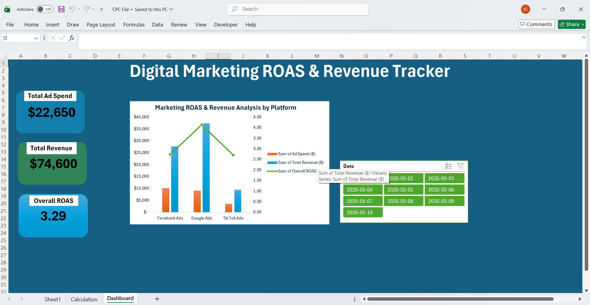

# 📊 Digital Marketing ROAS & Revenue Tracker (Excel)

An interactive Excel analytics dashboard designed to monitor multi-platform ad spend and return on investment across Facebook, Google, and TikTok.

## 🚀 Key Performance Indicators (KPIs)
* **Total Ad Spend:** $22,650
* **Total Revenue:** $74,600
* **Overall ROAS:** 3.29

## 🔍 Core Visual Insights
* **Platform Comparison:** Visualized marketing revenue analysis comparing ad spend against final sales by platform.
* **Timeline Analysis:** Tracked real-time performance variations across specific calendar dates using interactive charts.
* **Granular Filtering:** Integrated custom date-level slicers for immediate performance evaluation.

## 🛠️ Tech Stack & Methodology
* **Tool:** Microsoft Excel (Advanced)
* **Features Used:** Pivot Tables, Combined Bar-Line Charts, Dynamic Slicers, and Data Modeling.

---

## 📷 Dashboard Screenshot

## 🎥 Interactive Workflow (Silent Walkthrough)

